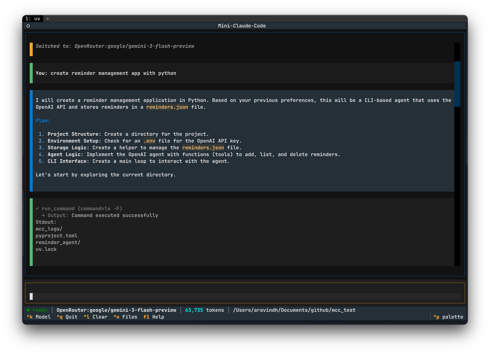

> This repo is for learning how Claude Code works. I tried to reverse engineer Claude Code and create a simple TUI. (Will not be maintained and PRs will not be accepted, feel free to clone and do whatever you want)

## Demo

[](./assets/mcc-demo.mov)

# Mini-Claude-Code

A TUI-based agentic coding assistant powered by [Agno](https://github.com/agno-agi/agno) and [Textual](https://github.com/Textualize/textual)

## Features

- **Multi-Provider**: Anthropic, OpenAI, Ollama, OpenRouter, Groq
- **Agentic Tools**: File ops, shell commands, Git, code search
- **Human-in-the-Loop**: Approval dialogs for writes and command execution
- **Project Memory**: AGENT.md for project-specific context
- **Streaming**: Real-time LLM response streaming

## Installation

```bash
uv sync --all-extras
```

## Usage

```bash
# Start in current directory
mcc

# Start in specific project
mcc /path/to/project

# Use a specific model
mcc -m openai:gpt-4o
mcc -m ollama:llama3.2
mcc --provider anthropic
```

## Keyboard Shortcuts

| Key | Action |
|-----|--------|
| `Enter` | Send message |
| `Shift+Enter` | New line |
| `Ctrl+Q` | Quit |
| `Ctrl+L` | Clear output |
| `Ctrl+K` | Model selector |
| `Ctrl+O` | File browser |
| `F1` | Help |

## Slash Commands

```
/help     - Show all commands
/clear    - Clear conversation
/compact  - Summarize conversation
/exit     - Exit

/context  - Show session info
/config   - Show configuration
/cost     - Show token usage
/model    - Switch model

/init     - Create AGENT.md
/review   - Review git changes
/commit   - Generate commit

/plan     - Create implementation plan
/bug      - Debug workflow
/test     - Generate tests
```

## Configuration

Set API keys via environment variables:

```bash
export ANTHROPIC_API_KEY="your-key"
export OPENAI_API_KEY="your-key"
```

## AGENT.md

Create an `AGENT.md` in your project root to give the agent context:

```bash
mcc
> /init
```


